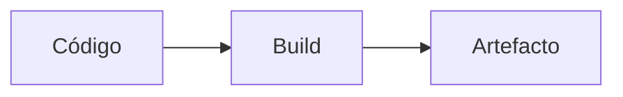

# Arquitetura — TrainerKit

## Overview

# TrainerKit

**A companion app for Pokémon GO that decides, instead of just showing numbers.**

There are enough calculators already. You attach the appraisal screenshot, "96.4%" shows up, and the real question is still unanswered: *so what?* Worth powering up? Worth evolving? Can I transfer it without regretting it?

TrainerKit answers that — and shows its work.

**[Open the app →](https://trainerkit-zeta.vercel.app/)**

Installable PWA, offline-first. No account, no server, nothing leaving your device.

## Install

It's a website, so there is nothing to download.

**iPhone / iPad** — open it in **Safari**, tap Share, then *Add to Home Screen*.

> On iOS this isn't optional. Safari erases the storage of any site left untouched for 7 days, and that would take your collection with it. Added to the Home Screen, it stays.

**Android** — open it in Chrome, menu ⋮, then *Install app*.

**Computer

## Stack

- Package: `trainerkit` 
- Gestor: **pnpm**
- Workspaces: sim (`pnpm-workspace.yaml` — `packages/*`, `apps/*`)
- Dependências (amostra): `ws`

## Árvore

```
├── api/
│   ├── _guarda.ts
│   ├── ai.ts
│   ├── tts.ts
│   └── tts11.ts
├── apps/
│   └── web/
├── deploy/
│   ├── README.md
│   └── vercel-web.json
├── packages/
│   ├── core/
│   └── dataset/
├── public-vercel/
│   └── index.html
├── scripts/
│   └── publicar.sh
├── DATA.md
├── IDEIAS.md
├── LICENSE
├── package.json
├── PEDIDOS.md
├── pnpm-lock.yaml
├── pnpm-workspace.yaml
├── README.md
├── REVISAO-LEGAL.md
├── REVISAO-POS-IMPORT.md
├── tsconfig.api.json
├── tsconfig.base.json
└── vercel.json
```



## Scripts disponíveis

| Script | Comando |
|--------|---------|
| `publicar` | `bash scripts/publicar.sh` |
| `dev` | `pnpm --filter @trainerkit/web dev` |
| `build` | `pnpm -r build` |
| `test` | `pnpm -r test` |
| `typecheck` | `pnpm -r typecheck && tsc -p tsconfig.api.json --noEmit` |
